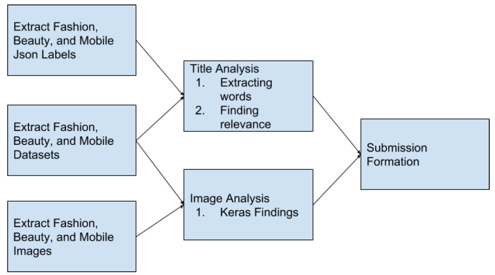

# ProductInformationExtraction
This is a part of Shopee Hackathon Project called National Data Science Challenge. 
All of the information regarding the challenge could be viewed here https://careers.shopee.sg/ndsc/.

## Introduction
Everyday there are hundreds of thousands new products added to Shopee. To make relevant products easily discoverable, one fundamental challenge is to accurately extract relevant information from large volume of products. For NDSC 2019, we present this real-world challenge of building an automatic solution to extract product related information through machine learning techniques. The image data is now available and you are supposed to analyze and predict the right tagging for the product.

## Approach
Our team decided to use python 3 with the libraries pandas, pillow, keras and tensorflow for this
project.

We are given Json, datasets, and images which later we bring forth to title and image analysis.
After getting and generating values for validation datasets, we then bring the formula for the
submission formation.

## Title Analysis
Our team and I decided on a hybrid approach to this project. The first angle will be to make
feature predictions based on a verbal only approach using just the title only. A pseudocode
breakdown of this algorithm is as follows:
1. We looked through the json label files and the title in the validation datasets.
2. Based on the titles and the validation labels, we then identify the relevance of each using
a statistical approach.
3. Based on this statistical approach, we then compare the titles and and the json
validations, which applies to the validation datasets which will be continued for
submissions.
Supplementary Material for Shoppee NDSC 2019 by Team The SNL
4. For whatever features that does not have statistical significance, we will use visual
methods to add a layer of prediction.

## Visual Analysis
Our second angle is to read all the images using pillow, convert into a standardized grayscale
thumbnail of size 28 by 28, and apply deep learning using keras to predict the features of each
category. The deep learning methodology mirrors very closely the sample jupyter notebook
codes on the analysis of fashion MNIST provided during the tensorflow training session which
we found very helpful in our project.

## Results
Based on this, we have received “satisfactory” results of 0.22 just by using just the verbal
attributes alone!

## Conclusions
There were some methods that have been used in our analysis, through trial and error and
matching with the train, validation datasets. We have reached a good analysis.

## Reflections
Our team and I had fun in this hackathon. However we shall now be focusing on our studies.
Looking forward to participate in a future hackathon!
Cheers, Team The SNL :D